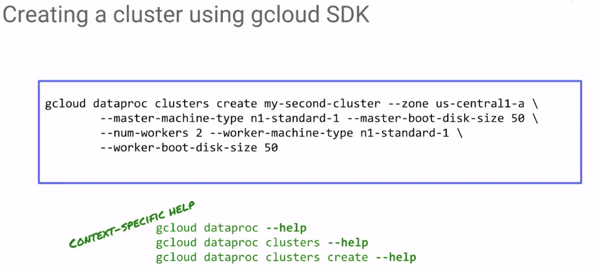
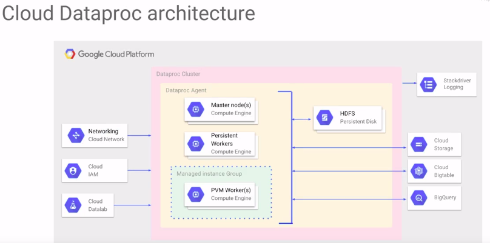
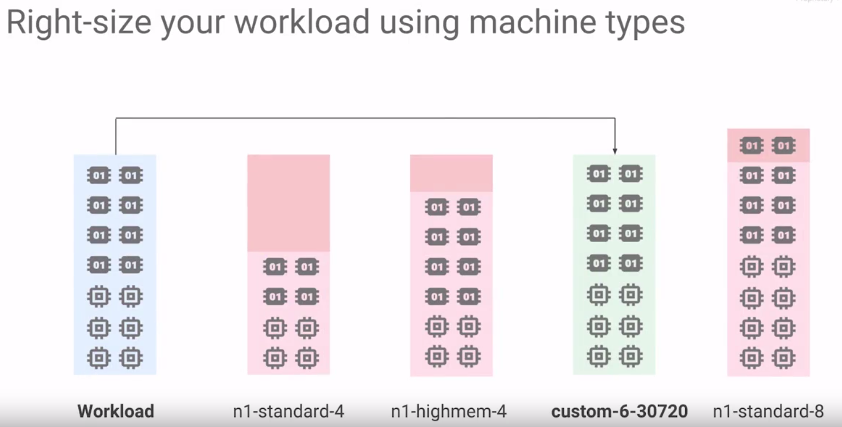

# Module 1

## Why Cloud Dataproc

* O Cloud Dataproc é uma implementação do Hadoop baseada em nuvem.
* O Dataproc é um serviço gerenciado do Hadoop no Google Cloud Platform. É rápido, prático e oferece vários recursos flexíveis e exclusivos.



## [Lab 1: Create a Dataproc Cluster](https://googlecoursera.qwiklabs.com/focuses/21290)

### Leveraging Unstructured Data - Lab 1 : Creating a Dataproc Cluster v1.3

```sh
echo "PROJECT_ID=qwiklabs-gcp-533ed647bbeb7d6e" > myenv
echo "BUCKET=qwiklabs-gcp-533ed647bbeb7d6e" >> myenv
echo "MYREGION=us-central1" >> myenv
echo "MYZONE=a" >> myenv
echo "BROWSER_IP=152.238.141.188" >> myenv
source myenv

echo $PROJECT_ID
echo $MYREGION $MYZONE
echo $BUCKET
echo $BROWSER_IP
```

## Dataproc Architecture





## Preemptible VMs

* Uma VM preemptiva é uma VM que você pode conseguir com desconto, sob a condição de que, se o Google precisar dela para uma VM persistente para alguém, poderá recuperá-la com um aviso mínimo

## Os principais pontos a serem lembrados são: 

* criar um cluster especificamente para um job,
* usar o Cloud Storage em vez do HDFS,
* desligar o cluster quando não estiver processando dados,
* usar máquinas personalizadas para corresponder aos requisitos de CPU e memória do job,
* em jobs não críticos que exigem clusters gigantescos, use VMs preemptivas para acelerar os resultados e reduzir os custos.


## Module 1 Quiz

### Which of the following statements are true about Cloud Dataproc? (Select all 2 correct answers)

* __Lets you run Spark and Hadoop clusters with minimal administration__
* Streamlined API for Spark and Hadoop programming
* __Helps you create job-specific clusters without HDFS__

### Match each of the terms with what they do when setting up clusters in Cloud Dataproc:

* Term	Definition
* __ 3. Preemptible	A. Costs less but may not be available always
* __ 1. Zone	B. Determines the Google data center where compute nodes will be
* __ 2. Standard Cluster mode	C. Provides 1 master and N workers
