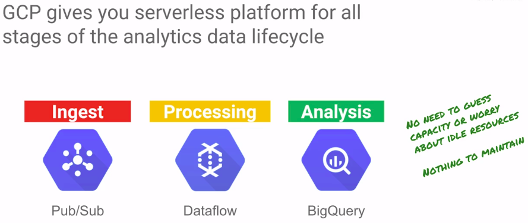

# Module 2 Running Dataproc Jobs

## Methods for submitting jobs

* Hive é declarativo
* Pig é imperativo

## Lab 2: Work with structured and semi-structured data

* Use the Hive CLI and run a Pig job
* Hive is used for structured data, similar to SQL
* Pig is used for semi-structured data, similar to SQL + scripting

```sh
gcloud compute --project=qwiklabs-gcp-821ba1c06b46d864 firewall-rules create allow-hadoop --direction=INGRESS --priority=1000 --network=default --action=ALLOW --rules=tcp:9870,tcp:8088 --source-ranges=152.238.141.188/32 --target-tags=hadoopaccess
```

```sh
cd
cp -r /training .
ls

ls
cd training/training-data-analyst/courses/unstructured
ls pet*.*

cat pet-details.txt

hadoop fs -mkdir /pet-details
hadoop fs -put pet-details.txt /pet-details
```

```sh
hive

CREATE DATABASE pets;
USE pets;

CREATE TABLE details (Type String, Name String, Breed String, Color String, Weight Int) ROW FORMAT DELIMITED FIELDS TERMINATED BY ',';
SHOW TABLES;
DESCRIBE pets.details;

load data INPATH '/pet-details/pet-details.txt' OVERWRITE INTO TABLE details;

SELECT * FROM pets.details;

quit;
```

```sh
cat pet-details.pig

rmf /GroupedByType
x1 = load '/pet-details' using PigStorage(',') as (Type:chararray,Name:chararray,Breed:chararray,Color:chararray,Weight:int);
x2 = filter x1 by Type != 'Type';
x3 = foreach x2 generate Type, Name, Breed, Color, Weight, Weight / 2.24 as Kilos:float;
x4 = filter x3 by LOWER(Color) == 'black' or LOWER(Color) == 'white';
x5 = group x4 by Type;
store x5 into '/GroupedByType';
```

```sh
hadoop fs -put pet-details.txt /pet-details
pig < pet-details.pig
```

```sh
cd
mkdir output
cd output
hadoop fs -get /GroupedByType/part* .

cat part-r-00000
#Cat     {(Cat,Joe,Mix,Black,15,6.696428571428571)}
#Dog     {(Dog,Rusty,Poodle,White,20,8.928571428571427),(Dog,Bree,MaltePoo,White,10,4.4642857142857135),(Dog,Noir,Schnoodle,Black,21,9.374999999999998)}
#Pig     {(Pig,Babe,Domestic,White,150,66.96428571428571)}
```

## Evolution of data processing





## [Cloud Dataproc Storage Services](https://d3c33hcgiwev3.cloudfront.net/_y-tl0xQEemPcBIa2xz0qA_c7addd5679874ef9b0d1d6b2e2b677b3_02-01-Cloud_Dataproc_Storage_Services.pdf?Expires=1561248000&Signature=CwVCFTbbgOi2yx068K~ypfV~VjT~zka7sZXk4wp8kGseosja7fMUKMYvWmSe5YmEeIIKGBXJr15roNi4GJgYadPRomVr6CxSUeG0ywlBra2y~6kjlHuWRWw5PNIwEJEVnBq4HtFIUFzfaKn4l3LkxbwqGWvRynMI4zwVRDh0LYg_&Key-Pair-Id=APKAJLTNE6QMUY6HBC5A)

## [Cloud Dataproc Automation Features Autoscaling and Cluster Deletion] (https://d3c33hcgiwev3.cloudfront.net/TBV_UUxREem4egrIUlgmqg_15e69ee78c654ef0ba3ac96a1d00bb4b_02-02-Cloud_Dataproc_Automation_Features.pdf?Expires=1561248000&Signature=gaZV3i5QnUZFth6NKmEdzbfY4Ts9JHwPuMu8sfj171Kg3VQeX7fMVhIAjvlzF6c9ZnokN83r4GT~kOQB2-J4qRU~CZTLeDxL1fgN7PJVVw9YxBVsh0tnb-0tLeuVrKzaIxHC6KIkBlkFbcXWv2HFxcOIUtGhD3zs4QpBZn6i~Dc_&Key-Pair-Id=APKAJLTNE6QMUY6HBC5A)

## Lab 3 : Submit Dataproc jobs for unstructured data

### Task 1: Preparation

* Dataproc > Clusters

```sh
gcloud compute --project "qwiklabs-gcp-99f8fa1373774e58" ssh --zone "us-central1-a" "dataproc-cluster-m"
```

### Task 2. Enable secure web access to the Dataproc cluster

```sh
gcloud compute --project=qwiklabs-gcp-99f8fa1373774e58 firewall-rules create allow-hadoop --direction=INGRESS --priority=1000 --network=default --action=ALLOW --rules=tcp:9870,tcp:8088 --source-ranges=152.238.141.188/32 --target-tags=hadoopaccess
```

### Task 3. Prepare the data

```sh
cd
cp -r /training .
ls
```

### Task 4. Explore HDFS and Cloud Storage

```sh
hadoop fs -ls /

cd ~/training
ls

hadoop fs -mkdir /sampledata
hadoop fs -copyFromLocal road-not-taken.txt /sampledata/.
hadoop fs -copyFromLocal sherlock-holmes.txt /sampledata/.

hadoop fs -ls /sampledata
```

### Task 5. Use interactive PySpark to learn about RDDs and Lambda functions

[rdd-programming-guide](https://spark.apache.org/docs/latest/rdd-programming-guide.html)

```python
pyspark

lines = sc.textFile("/sampledata/sherlock-holmes.txt")
type(lines)
lines.count()
lines.take(15)

words =  lines.flatMap(lambda x: x.split(' '))
type(words)
words.count()
words.take(15)

pairs = words.map(lambda x: (len(x),1))
pairs.take(5)

from operator import add
wordsize = pairs.reduceByKey(add)
type(wordsize)
wordsize.count()
wordsize.take(5)

output = wordsize.collect()
type(output)
for (size,count) in output: print(size, count)

output = wordsize.sortByKey().collect()
for (size,count) in output: print(size, count)
```

```python
from operator import add
lines = sc.textFile("/sampledata/sherlock-holmes.txt")

words =  lines.flatMap(lambda x: x.split(' '))
pairs = words.map(lambda x: (len(x),1))
wordsize = pairs.reduceByKey(add)
output = wordsize.sortByKey().collect()

output2 =  lines.flatMap(lambda x: x.split(' ')).map(lambda x: (len(x),1)).reduceByKey(add).sortByKey().collect()

for (size, count) in output2: print(size, count)
```

### Task 6: Submit a PySpark job from the Master Node

```python (wordcount.py)
from pyspark.sql import SparkSession
from operator import add
import re

print("Okay Google.")

spark = SparkSession\
        .builder\
        .appName("CountUniqueWords")\
        .getOrCreate()

lines = spark.read.text("/sampledata/road-not-taken.txt").rdd.map(lambda x: x[0])
counts = lines.flatMap(lambda x: x.split(' ')) \
                  .filter(lambda x: re.sub('[^a-zA-Z]+', '', x)) \
                  .filter(lambda x: len(x)>1 ) \
                  .map(lambda x: x.upper()) \
                  .map(lambda x: (x, 1)) \
                  .reduceByKey(add) \
                  .sortByKey()
output = counts.collect()
for (word, count) in output:
  print("%s = %i" % (word, count))

spark.stop()
```

```sh
rm -rf wordcount.py
curl https://gist.githubusercontent.com/afonsoaugusto/63b1ff49a8418eb1b94e645acdfd3607/raw/9004ff9993a4e2844af782646de58f7d1e8c2300/wordcount.py -o wordcount.py

spark-submit wordcount.py
```

### Task 7: Master Node timeout

## Module 2 Quiz

### Cloud Dataproc provides the ability for Spark programs to separate compute & storage by:

* __Reading and writing data directory from/to Cloud Storage__
* Pre-copying data from Cloud Storage to persistent disk on cluster startup
* Mirroring data on both Cloud Storage and HDFS
* Setting individual zones for compute and storage

## Lab 4 : Leverage GCP

### Task 1: Prepare the Master Node and the Bucket

```sh
cd
cp -r /training .
ls

export BUCKET=qwiklabs-gcp-b68b1578d5f937d5
echo $BUCKET
```

### Task 2. The two letter lab

```sh
gsutil cp /training/road-not-taken.txt gs://$BUCKET

curl https://gist.githubusercontent.com/afonsoaugusto/516e995c064b50fb920f946a68b1629f/raw/9e6017972fbee9329a9f03bbd26664d60c5f0fbe/wordcount2.py -o wordcount.py
```

```python
from pyspark.sql import SparkSession
from operator import add
import re

print("Okay Google.")

spark = SparkSession\
        .builder\
        .appName("CountUniqueWords")\
        .getOrCreate()

lines = spark.read.text("/sampledata/road-not-taken.txt").rdd.map(lambda x: x[0])
counts = lines.flatMap(lambda x: x.split(' ')) \
                  .filter(lambda x: re.sub('[^a-zA-Z]+', '', x)) \
                  .filter(lambda x: len(x)>1 ) \
                  .map(lambda x: x.upper()) \
                  .map(lambda x: (x, 1)) \
                  .reduceByKey(add) \
                  .sortByKey()
output = counts.collect()
for (word, count) in output:
  print("%s = %i" % (word, count))

spark.stop()
```

```sh
hadoop fs -ls /
hadoop fs -ls gs://$BUCKET

sed -i 's/"/sampledata"/"gs://qwiklabs-gcp-b68b1578d5f937d5"/g' wordcount.py

spark-submit wordcount.py
```

### Task 3. Run a PySpark application from Cloud Storage

```sh
gsutil cp wordcount.py gs://$BUCKET
```
