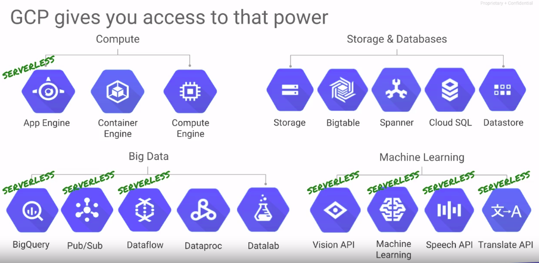

# Module 2 Running Dataproc Jobs

## Methods for submitting jobs

* Hive é declarativo
* Pig é imperativo

## Lab 2: Work with structured and semi-structured data

* Use the Hive CLI and run a Pig job
* Hive is used for structured data, similar to SQL
* Pig is used for semi-structured data, similar to SQL + scripting

```sh
gcloud compute --project=qwiklabs-gcp-821ba1c06b46d864 firewall-rules create allow-hadoop --direction=INGRESS --priority=1000 --network=default --action=ALLOW --rules=tcp:9870,tcp:8088 --source-ranges=152.238.141.188/32 --target-tags=hadoopaccess
```

```sh
cd
cp -r /training .
ls

ls
cd training/training-data-analyst/courses/unstructured
ls pet*.*

cat pet-details.txt

hadoop fs -mkdir /pet-details
hadoop fs -put pet-details.txt /pet-details
```

```sh
hive

CREATE DATABASE pets;
USE pets;

CREATE TABLE details (Type String, Name String, Breed String, Color String, Weight Int) ROW FORMAT DELIMITED FIELDS TERMINATED BY ',';
SHOW TABLES;
DESCRIBE pets.details;

load data INPATH '/pet-details/pet-details.txt' OVERWRITE INTO TABLE details;

SELECT * FROM pets.details;

quit;
```

```sh
cat pet-details.pig

rmf /GroupedByType
x1 = load '/pet-details' using PigStorage(',') as (Type:chararray,Name:chararray,Breed:chararray,Color:chararray,Weight:int);
x2 = filter x1 by Type != 'Type';
x3 = foreach x2 generate Type, Name, Breed, Color, Weight, Weight / 2.24 as Kilos:float;
x4 = filter x3 by LOWER(Color) == 'black' or LOWER(Color) == 'white';
x5 = group x4 by Type;
store x5 into '/GroupedByType';
```

```sh
hadoop fs -put pet-details.txt /pet-details
pig < pet-details.pig
```

```sh
cd
mkdir output
cd output
hadoop fs -get /GroupedByType/part* .

cat part-r-00000
#Cat     {(Cat,Joe,Mix,Black,15,6.696428571428571)}
#Dog     {(Dog,Rusty,Poodle,White,20,8.928571428571427),(Dog,Bree,MaltePoo,White,10,4.4642857142857135),(Dog,Noir,Schnoodle,Black,21,9.374999999999998)}
#Pig     {(Pig,Babe,Domestic,White,150,66.96428571428571)}
```

## Evolution of data processing




## [Cloud Dataproc Storage Services](https://d3c33hcgiwev3.cloudfront.net/_y-tl0xQEemPcBIa2xz0qA_c7addd5679874ef9b0d1d6b2e2b677b3_02-01-Cloud_Dataproc_Storage_Services.pdf?Expires=1561248000&Signature=CwVCFTbbgOi2yx068K~ypfV~VjT~zka7sZXk4wp8kGseosja7fMUKMYvWmSe5YmEeIIKGBXJr15roNi4GJgYadPRomVr6CxSUeG0ywlBra2y~6kjlHuWRWw5PNIwEJEVnBq4HtFIUFzfaKn4l3LkxbwqGWvRynMI4zwVRDh0LYg_&Key-Pair-Id=APKAJLTNE6QMUY6HBC5A)

## [Cloud Dataproc Automation Features Autoscaling and Cluster Deletion] (https://d3c33hcgiwev3.cloudfront.net/TBV_UUxREem4egrIUlgmqg_15e69ee78c654ef0ba3ac96a1d00bb4b_02-02-Cloud_Dataproc_Automation_Features.pdf?Expires=1561248000&Signature=gaZV3i5QnUZFth6NKmEdzbfY4Ts9JHwPuMu8sfj171Kg3VQeX7fMVhIAjvlzF6c9ZnokN83r4GT~kOQB2-J4qRU~CZTLeDxL1fgN7PJVVw9YxBVsh0tnb-0tLeuVrKzaIxHC6KIkBlkFbcXWv2HFxcOIUtGhD3zs4QpBZn6i~Dc_&Key-Pair-Id=APKAJLTNE6QMUY6HBC5A)